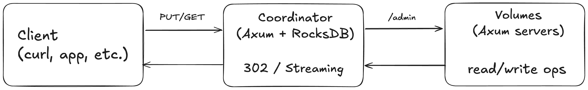

# nanokv

[](LICENSE)


A simple, production-minded distributed object store optimized for values between 1 MB and 1 GB. Think “S3-like blobs with a KV API,” built to be understandable, hackable, and safe by default.

Coordinator: routes writes, tracks metadata in RocksDB, manages placement and health.

Volume servers: store blobs on local filesystems; expose a tiny HTTP API for reads/writes/admin.

Replication & placement: uses Highest-Random-Weight (HRW/Rendezvous) hashing.

Write path: 2-phase prepare→commit with time-boxed retries; strong consistency for PUT/DELETE.

Ops tools: verify, repair, rebuild, gc shipped as first-class CLI commands.

This repository is meant both as a a useful building block for small/medium datasets, lab clusters, and edge storage.

## Features

- [x] HTTP API (Axum) — easy to curl, easy to integrate
- [x] RocksDB metadata; filesystem blob storage
- [x] N-way replication with HRW placement
- [x] Strongly consistent PUT/DELETE (coordinator-orchestrated)
- [x] Ops commands: `serve`, `rebuild`, `rebalance`, `verify`, `repair`, `gc`
- [x] Resumable jobs (journaling for long-running operations)
- [x] 1 MB–1 GB blob sweet spot (works outside that range; perf characteristics differ)

## Benchmarks

First, make sure you install `jq`. On MacOS, run:

```bash
brew install jq
```

To run the benchmarks locally, you can run the following:

```bash
# Comprehensive benchmark script for nanokv
# Builds coordinator and volume servers, launches cluster, and runs k6 benchmark

# Use all defaults (3 volumes, 3 replicas)
./run_benchmark.sh

# Launch 5 volumes with default settings
./run_benchmark.sh 5

# Full configuration: 5 volumes, 3 replicas, custom ports, 32 VUs, 60s duration, 2MB objects
./run_benchmark.sh 5 3 3000 3001 32 "60s" 2097152

# Show help
./run_benchmark.sh --help
```

## Architecture at a glance



### Coordinator

Keeps metadata: state, size, etag, replicas[], timestamps.

Chooses placement with HRW among Alive nodes.

Orchestrates writes via internal volume endpoints: prepare → pull → commit (abort on failure).

Exposes admin endpoints to query node health and state.

### Volume

Stores blobs under `blobs/aa/bb/<percent-encoded-key>`.

Minimal admin API for listing keys, probing blob size/etag, and GC of temp files.

No index at volume; coordinator is the source of truth.

## HTTP APIs

### Public data API (coordinator)

```
PUT /{key} — write object (redirects/streams to chosen volume(s) via 2PC)
GET /{key} — read object (redirect or proxy-stream)
DELETE /{key} — delete object (tombstone + volume deletes)
```

### Volume admin (used by ops commands)

```
GET /admin/list?limit=&after=&prefix= — list keys (paged with cursor)
GET /admin/blob?key=&deep= — {exists,size,etag?} (etag only when deep=true)
POST /internal/prepare?key=&upload_id=&expected_size=
POST /internal/pull?upload_id=&from= — destination pulls from source’s public URL
POST /internal/commit?upload_id=&key=
POST /internal/abort?upload_id=
POST /internal/delete?key=
POST /admin/sweep_tmp?safe_age_secs=
```

### Coordinator admin

```
POST /admin/join — volume announces itself
POST /admin/heartbeat
GET /admin/nodes — inventory + health
```

## Getting Started (local dev)
### Prerequisites

Rust 1.75+ (stable)
RocksDB (via rust-rocksdb; build deps vary per OS)

### Build

```bash
cargo build --release
```

Run a tiny cluster (example)

### 1) Start two volume servers

```bash
V1_PORT=3001 cargo run --bin volume -- --data ./vol1
V2_PORT=3002 cargo run --bin volume -- --data ./vol2
```

### 2) Start coordinator

```bash
cargo run --bin coord -- \
  serve \
  --db ./indexdb \
  --replicas 2 \
  --volumes http://127.0.0.1:3001,http://127.0.0.1:3002
```

## Try it

#### Put
```bash
curl -L -X PUT --data-binary @/path/to/bigfile.bin http://127.0.0.1:3000/my%2Ffile.bin
```

#### Get
```bash
curl -L -o ./out.bin http://127.0.0.1:3000/my%2Ffile.bin
```

#### Delete
```bash
curl -L -X DELETE http://127.0.0.1:3000/my%2Ffile.bin
```

Keys are percent-encoded. Example raw key `my/file.bin`becomes `my%2Ffile.bin`.

## CLI (Ops) Commands

All run as coordinator subcommands (names may differ in your binary; adapt as needed).

### rebuild

Reconstructs metadata from volumes.

```bash
coord rebuild \
  --index ./indexdb \
  --nodes http://127.0.0.1:3001,http://127.0.0.1:3002 \
  --deep=false \
  --dry-run=false \
  --concurrency 16
```

Scans `/admin/list` on each volume, probes /admin/blob for (size, etag?).

Writes Committed metas when all observed variants agree.

Preserves existing tombstones (never resurrects).

`--deep=true` computes/uses etag (slower; cryptographic checksum).

### verify

Audits the cluster for:

Under-replicated keys (missing expected replicas),

Corrupted replicas (size/etag mismatch),

Unindexed files (data on disk, no meta),

Should-GC files (tombstoned meta, data still present).

```bash
coord verify \
  --index ./indexdb \
  --nodes nodeA=http://127.0.0.1:3001,nodeB=http://127.0.0.1:3002 \
  --deep=false \
  --concurrency 16
```

### repair

Copies data until each key reaches the target replication factor N (without removing extras).

```bash
coord repair \
  --index ./indexdb \
  --replicas 2 \
  --concurrency 8 \
  --concurrency-per-node 2 \
  --dry-run=false
```

Picks valid sources (exist + match size/etag).

Copies to needed destinations. Resumable via a small journal.

### gc

Garbage collect:

Tombstones older than TTL (delete on replicas; optionally broadcast),

Sweep tmp/,

Optionally delete extraneous replicas and orphan files.

```bash
coord gc \
  --index ./indexdb \
  --tombstone-ttl 7d \
  --purge-tombstone-meta=false \
  --delete-extraneous=false \
  --purge-orphans=false \
  --sweep-tmp-age 1h \
  --concurrency 16
```

## Configuration & Operational Notes

Consistency: Coordinator orchestrates PUT/DELETE with 2PC-style prepare/commit + abort on failure; requests are strongly consistent from the client’s perspective.

Placement: HRW hashing over Alive nodes (heartbeat-driven). repair ensures N replicas; rebalance (optional) aligns layout to current HRW target set; gc cleans extras.

Indices: Only coordinator has metadata (RocksDB). Volumes do not maintain an index.

Checksums: etag is BLAKE3 hex when deep=true is used during PUT or probe; otherwise metas may have an empty etag until verify `--deep` fills it in.

Key format: Keys are arbitrary bytes surfaced as percent-encoded in URLs and on disk (file name component).

Blob layout: `blobs/aa/bb/<key-enc>`, where aa and bb are the first two bytes of BLAKE3(key). This keeps directories small.

## Development

### Run tests
```bash
# Run regular tests (excludes heavy/resource-intensive tests)
cargo test

# Run all tests including heavy tests (large object streaming, etc.)
cargo test --features heavy-tests

# Run only heavy tests
cargo test --features heavy-tests -- --ignored
```

### Lints & formatting
```bash
cargo fmt --all -- --check
cargo clippy --all-targets -- -D warnings
```

## Contributing

Issues and PRs are welcome! Please:

Run fmt and clippy before pushing.

Add/extend tests for new behavior.

Keep changesets focused and well-documented.

